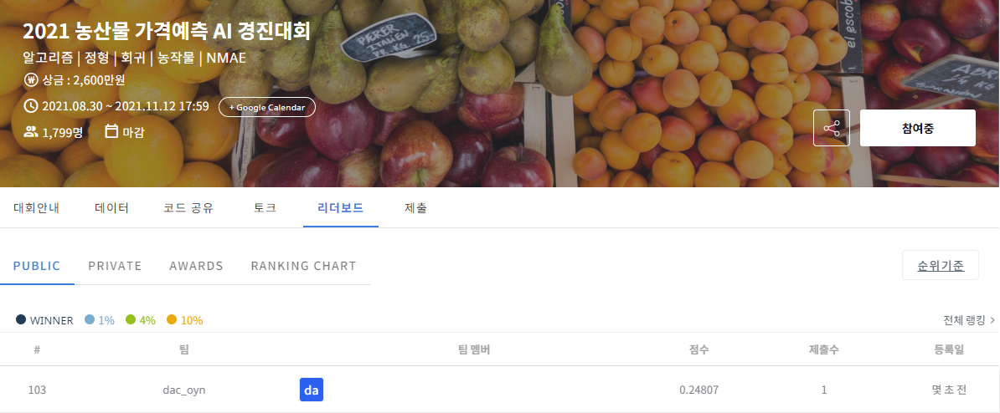

# 2021 농산물 가격예측 AI 경진대회
-----------------------------------
# 결과
-----------------------------------
### 요약 정보
  * 도전기관 : SecuLayer
  * 도전자 : 윤민식
  * 최종 스코어 : 0.24807
  * 제출 일자 : 2023-06-26
  * 총 참여 팀수 : 1799
  * 순위 및 비율 : 103 (5.7%)
# 결과 화면
-----------------------------------

# 사용한 방법 & 알고리즘
----------------------------------
  * lightgbm 사용
  * 채소별 데이터 분리
  * 채소 각각 학습 실행
  * 채소 각각 값 예측
# 코드
----------------------------------
[2021 농산물 가격예측 AI 경진대회.ipynb](./2021_농산물_가격예측_AI_경진대회.ipynb)
# 참고자료
----------------------------------
[https://dacon.io/competitions/official/235801/codeshare/3349?page=1&dtype=recent](https://dacon.io/competitions/official/235801/codeshare/3349?page=1&dtype=recent)
