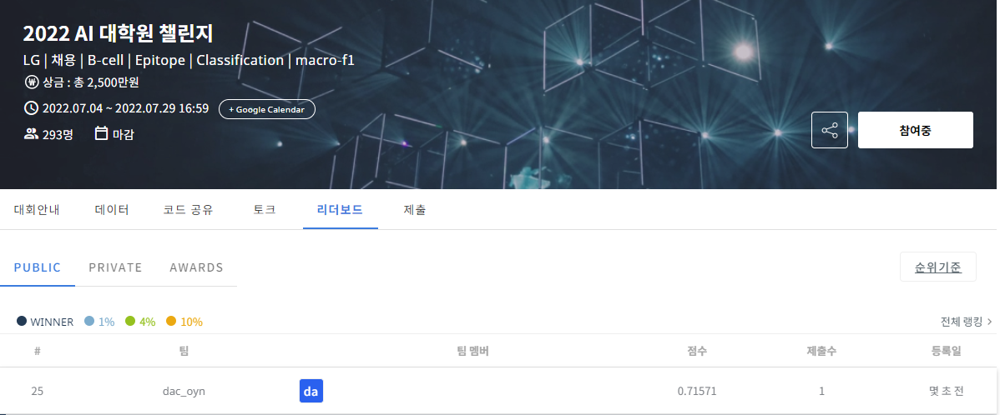

# 2022 AI 대학원 챌린지
-----------------------------------
# 결과
-----------------------------------
### 요약 정보
  * 도전기관 : SecuLayer
  * 도전자 : 윤민식
  * 최종 스코어 : 0.71571
  * 제출 일자 : 2023-07-05
  * 총 참여 팀수 : 293
  * 순위 및 비율 : 25 (8.5%)
# 결과 화면
-----------------------------------

# 사용한 방법 & 알고리즘
----------------------------------
  * 도메인 관련 전처리
  * LabelEncoding 사용해 데이터 수치화
  * CatBoostClassifier 사용해 학습
# 코드
----------------------------------
[2022 AI 대학원 챌린지](./2022 AI 대학원 챌린지.ipynb)
# 참고자료
----------------------------------
[https://dacon.io/competitions/official/235932/codeshare/5905?page=1&dtype=recent](https://dacon.io/competitions/official/235932/codeshare/5905?page=1&dtype=recent)
