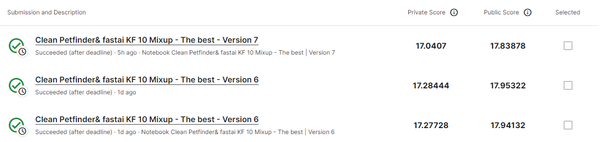
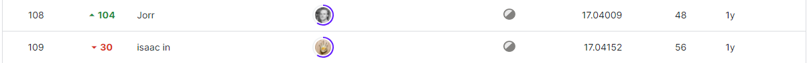

# PetFinder.my - Pawpularity Contest
-----------------------------------
# 결과
-----------------------------------
### 요약 정보
  * 도전기관 : SecuLayer
  * 도전자 : 윤민식
  * 최종 스코어 : 0.17.94132
  * 제출 일자 : 2023-07-06
  * 총 참여 팀수 : 3537
  * 순위 및 비율 : 1005 (28.4%)
# 결과 화면
-----------------------------------

# 사용한 방법 & 알고리즘
----------------------------------
  * fastai 사용해 이미지 처리
  * fastai 사용해 모델 학습
# 코드
----------------------------------
[PetFinder.my - Pawpularity Contest](./PetFinder.my - PawPularity Contest.ipynb)
# 참고자료
----------------------------------
[https://www.kaggle.com/code/adityasharma01/fork-of-17-90508-notebook](https://www.kaggle.com/code/adityasharma01/fork-of-17-90508-notebook)
