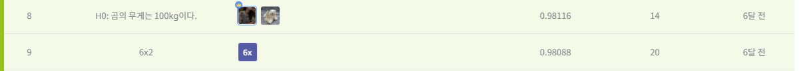

# 유전체 정보 품종 분류 AI 경진대회
-----------------------------------
# 결과
-----------------------------------
### 요약 정보
  * 도전기관 : SecuLayer
  * 도전자 : 윤민식
  * 최종 스코어 : 0.99063
  * 제출 일자 : 2023-06-27
  * 총 참여 팀수 : 1283
  * 순위 및 비율 : 80 (6.2%)
# 결과 화면
-----------------------------------

# 사용한 방법 & 알고리즘
----------------------------------
  * RandomForest 사용
  * 범주형 데이터 -> 수치형 데이터: 원 핫 인코딩
  * 결측치 채우고 학습
# 코드
----------------------------------
[유전체 정보 품종 분류 AI 경진대회](./유전체 정보 품종 분류 AI 경진대회.ipynb)
# 참고자료
----------------------------------
[https://dacon.io/competitions/official/236035/codeshare/7435?page=1&dtype=recent](https://dacon.io/competitions/official/236035/codeshare/7435?page=1&dtype=recent)
